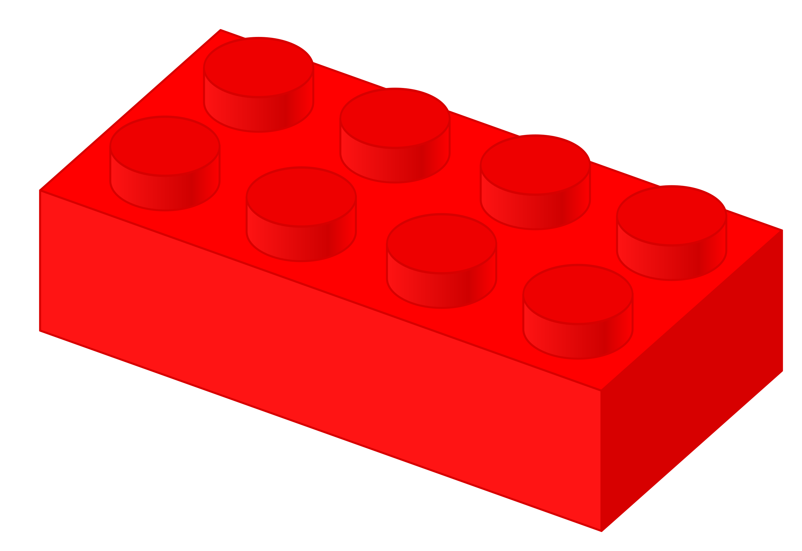

# Lego Detector

## Introduction
Welcome to the Lego Detector project!

This repository hosts a Jupyter notebook that utilizes OpenCV to identify and create bounding boxes around Lego bricks in a photograph. The primary goal of this project is to isolate each Lego brick in an image, enabling further analysis by another AI system. 

This analysis could potentially suggest Lego models that users can build with their available set of bricks, simply by taking a photo of their collection.

## Project Structure

Lego_Detector.ipynb: The main Jupyter notebook containing the image processing and Lego detection algorithm.

## Getting Started

### Prerequisites
- Python 3
- Jupyter Notebook
- OpenCV-Python

Other dependencies as listed in the requirements.txt file.

## Installation
Clone the repository:
```bash
git clone https://github.com/thomas-rooty/lego-detector.git
```

Install the required Python packages:
```bash
pip install -r requirements.txt
```

## Usage
To use the Lego Detector:

1. Open the Lego_Detector.ipynb notebook in Jupyter Notebook.
2. Run the cells in order to process an image with Lego bricks.

The notebook will display the processed image with bounding boxes around each detected Lego brick and generate JPG files for each found brick.

## Contributing
Contributions to the Lego Detector are welcome! Whether it's reporting a bug, proposing a feature, or submitting a pull request, all contributions are appreciated.

## License
This project is licensed under the MIT License.

## Contact
For any queries or discussions about the project, feel free to contact me here on GitHub.
